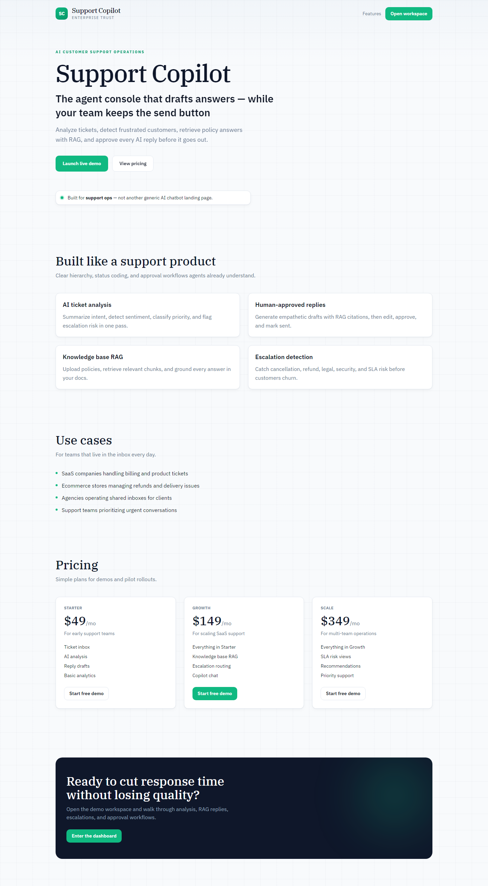
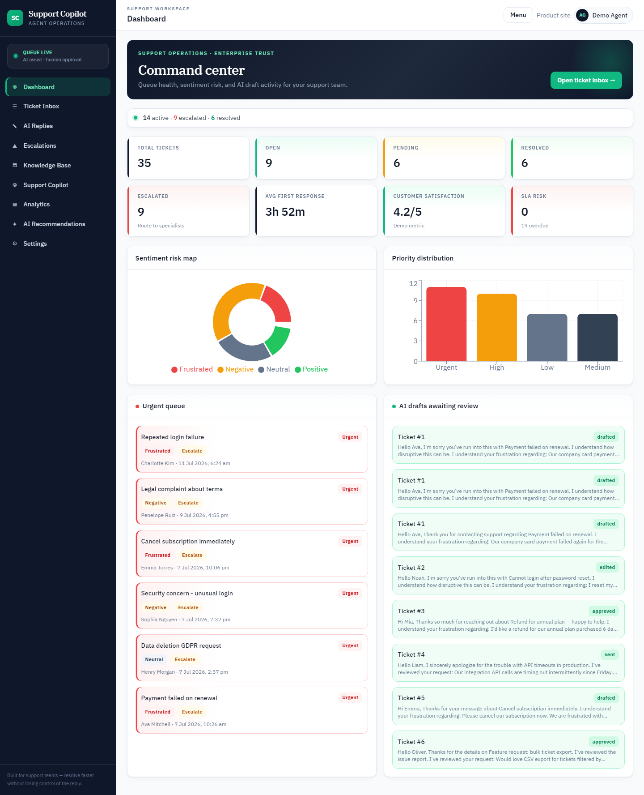
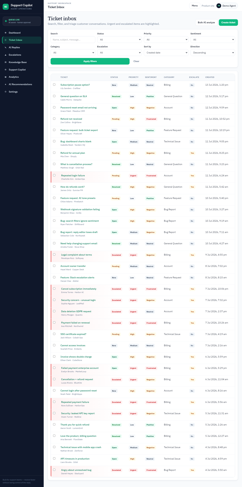
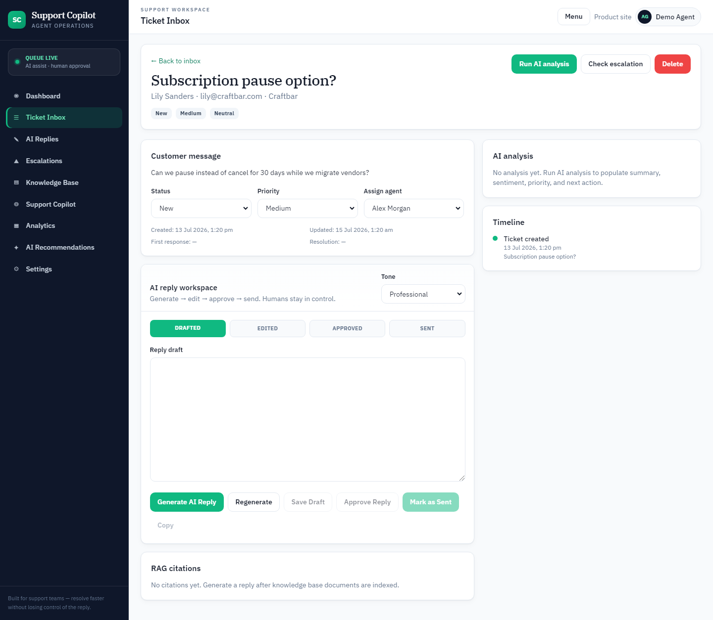
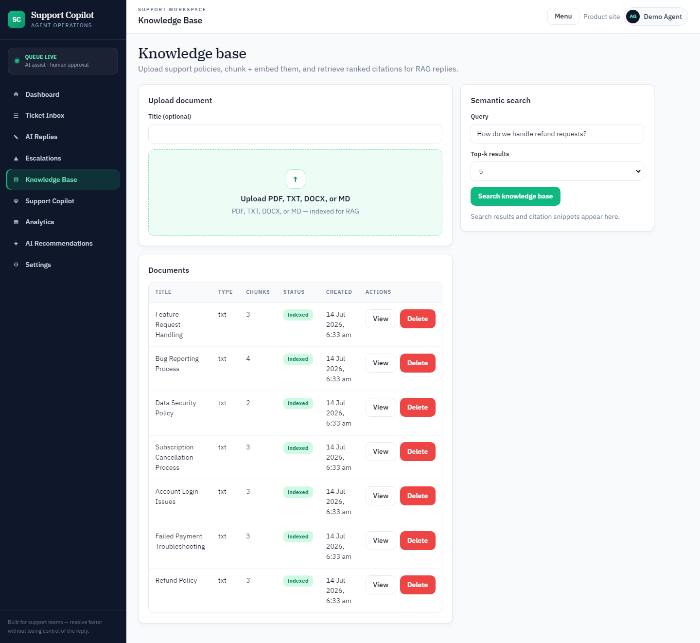
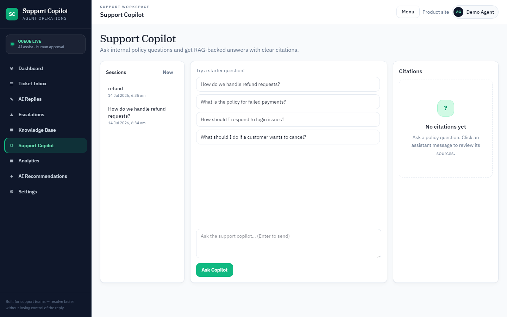

# AI Customer Support Copilot

AI-powered customer support dashboard for managing tickets, generating high-quality reply suggestions, detecting sentiment, classifying priority, recommending escalations, and answering questions with a knowledge base RAG system.

**Repo:** `ai-customer-support-copilot`

## Problem

Support teams often answer the same questions repeatedly, miss urgent tickets, and spend too much time writing manual replies. Frustrated customers escalate late, SLA clocks run out, and institutional knowledge lives in scattered documents instead of the inbox workflow.

## Solution

**AI Customer Support Copilot** combines a production-style support inbox with hybrid rule + LLM ticket analysis, human-approved AI replies, escalation detection, response-time / SLA analytics, and a RAG knowledge base (PostgreSQL + Qdrant, with local fallbacks for easy demos).

## Business Value

AI Customer Support Copilot helps businesses reduce response time, improve support quality, prioritize urgent tickets, and assist agents with AI-generated replies. It keeps humans in control while using AI to analyze customer intent, detect sentiment, recommend escalation, and retrieve accurate answers from the company knowledge base.

## Use Cases

- **SaaS companies** — triage billing failures, login lockouts, and product bugs with AI priority + escalation routing.
- **Ecommerce stores** — speed up refunds, cancellation requests, and shipping complaint replies with policy citations.
- **Agencies** — run a shared support inbox with tone-controlled drafts and manager approval before send.
- **Support teams** — coach agents with a RAG copilot, SLA risk views, and operations recommendations.

## Key Features

- SaaS landing page and portfolio-ready dashboard
- Full ticket inbox CRUD with search, filters, sorting, and bulk AI analysis
- AI ticket analysis (summary, intent, sentiment, explainable priority, category, risk, next action)
- AI reply generation with tone controls and human approval workflow
- Escalation detection with team routing, SLA risk signals, and internal notes
- Knowledge base upload (PDF / TXT / DOCX), chunking with overlap, embeddings, Qdrant search
- Support Copilot chat with RAG citations and no-context fallbacks
- Analytics, SLA risk, and AI operations recommendations
- Settings for business defaults, SLA hours, and AI provider placeholders
- Mock AI fallback when no API key is configured

## Screenshots

### Landing



### Dashboard



### Ticket inbox



### Ticket detail



### Knowledge base



### Support Copilot



## AI Ticket Analysis Workflow

1. Agent opens a ticket (or creates one).
2. Rules scan for refund, cancellation, payment failure, login, security, legal, and angry language signals.
3. AI (or mock engine) returns structured analysis: summary, intent, sentiment, priority, escalation, tone, risk, next action.
4. Ticket fields update; urgent / frustrated cases surface on the dashboard.

## AI Reply Generation Workflow

1. Agent chooses a tone (Professional, Friendly, Empathetic, Concise, Technical, Apologetic).
2. RAG retrieves relevant knowledge base chunks for the ticket.
3. AI drafts a reply with greeting, acknowledgment, next step, empathy, and closing.
4. Citations are shown for transparency.
5. Agent edits → **Save Draft** → **Approve Reply** → **Mark as Sent** (human-in-the-loop; nothing auto-sends).

## Knowledge Base RAG Workflow

1. Upload policy documents (PDF, TXT, DOCX).
2. Text is extracted, chunked, and embedded.
3. Vectors are stored in Qdrant (or an in-memory store if Qdrant is offline).
4. Reply generation and Copilot chat retrieve top chunks and attach citations.

## Tech Stack

| Layer | Stack |
| --- | --- |
| Frontend | React, Vite, Tailwind CSS, Axios, React Router, Recharts |
| Backend | FastAPI, Python, SQLAlchemy, Pydantic |
| Data | PostgreSQL (Docker) / SQLite (local demo) |
| Vectors | Qdrant (+ in-memory fallback) |
| AI | OpenAI-compatible API or realistic mock fallback |

## Architecture

```
Browser (React)
    │  REST / JSON
    ▼
FastAPI routes
    ├── Ticket / analysis / reply / escalation services
    ├── RAG (chunk → embed → vector search)
    ├── Analytics & recommendations
    └── AI service (OpenAI-compatible or mock)
         │
         ├── SQLAlchemy → PostgreSQL / SQLite
         └── Qdrant (optional)
```

## Folder Structure

```
ai-customer-support-copilot/
├── backend/
│   ├── main.py
│   ├── config.py
│   ├── database.py
│   ├── models.py
│   ├── schemas.py
│   ├── seed.py
│   ├── requirements.txt
│   ├── routes/
│   ├── services/
│   └── utils/
├── frontend/
│   └── src/
│       ├── api/
│       ├── components/
│       ├── pages/
│       └── utils/
├── docker-compose.yml
└── README.md
```

## Setup Instructions

### Option A — Local (SQLite + mock AI)

**Backend**

```bash
cd backend
python -m venv .venv

# Windows
.venv\Scripts\activate

# macOS / Linux
source .venv/bin/activate

pip install -r requirements.txt
copy .env.example .env   # or cp .env.example .env
python seed.py
uvicorn main:app --reload --port 8000
```

If port `8000` is already in use on your machine, start on another port (for example `8010`) and set `VITE_API_URL` in `frontend/.env` to match.

**Frontend**

```bash
cd frontend
npm install
copy .env.example .env   # or cp .env.example .env
npm run dev
```

Open:

- App: http://localhost:5173  
- API docs: http://127.0.0.1:8000/docs (or your chosen backend port)  


Demo user (from seed): `agent@supportcopilot.dev` / `demo1234`

### Option B — Docker (PostgreSQL + Qdrant + app)

```bash
docker compose up --build
```

- Frontend: http://localhost:3000  
- Backend: http://localhost:8000  

Then seed inside the backend container:

```bash
docker compose exec backend python seed.py
```

## Environment Variables

| Variable | Description |
| --- | --- |
| `OPENAI_API_KEY` | Optional. If empty, mock AI responses are used |
| `OPENAI_BASE_URL` | OpenAI-compatible base URL |
| `CHAT_MODEL` | Chat model name |
| `EMBEDDING_MODEL` | Embedding model name |
| `EMBEDDING_DIMENSIONS` | Embedding vector size (default 384; passed to OpenAI when supported) |
| `RAG_TOP_K` | Default retrieval count for replies/search |
| `RAG_MIN_SCORE` | Minimum vector similarity to accept a hit |
| `CHUNK_SIZE` / `CHUNK_OVERLAP` | Knowledge base chunking |
| `QDRANT_API_KEY` | Optional Qdrant auth |
| `DATABASE_URL` | SQLAlchemy URL (`sqlite:///./support_copilot.db` or Postgres) |
| `QDRANT_URL` | Qdrant HTTP endpoint |
| `QDRANT_COLLECTION` | Collection name |
| `SECRET_KEY` | JWT secret (auth scaffold) |
| `CORS_ORIGINS` | Comma-separated frontend origins |
| `VITE_API_URL` | Frontend API base URL (leave empty to use Vite `/api` proxy) |

## API Endpoints

**Tickets:** `GET/POST /api/tickets`, `GET/PUT/DELETE /api/tickets/{id}`

**Analysis:** `POST /api/analysis/analyze-ticket/{ticket_id}`, `POST /api/analysis/bulk-analyze`, `GET /api/analysis/{ticket_id}`

**Replies:** `POST /api/replies/generate/{ticket_id}`, `GET /api/replies`, `GET/PUT/DELETE /api/replies/{id}`, `POST /api/replies/{id}/approve`, `POST /api/replies/{id}/mark-sent`

**Escalations:** `GET /api/escalations`, `POST /api/escalations/check/{ticket_id}`, `PUT /api/escalations/{id}`, `POST /api/escalations/{id}/resolve`

**Knowledge base:** `POST /api/knowledge-base/upload`, `GET /api/knowledge-base/documents`, `GET/DELETE /api/knowledge-base/documents/{id}`, `POST /api/knowledge-base/search`

**Copilot:** `POST /api/copilot-chat/ask`, `GET /api/copilot-chat/sessions`, `GET /api/copilot-chat/sessions/{id}`

**Analytics:** `GET /api/analytics/dashboard`, `GET /api/analytics/tickets`, `GET /api/analytics/response-times`

**Recommendations:** `GET /api/recommendations`, `POST /api/recommendations/generate`

**Settings:** `GET/PUT /api/settings`

**Auth (JWT-ready):** `POST /api/auth/register`, `POST /api/auth/login`, `GET /api/auth/me`

## Demo Workflow

1. Open the landing page, then launch the dashboard.
2. Browse seeded urgent / frustrated tickets in the inbox.
3. Open a ticket → **Run AI analysis** → review sentiment, priority, and escalation reason.
4. **Generate AI Reply** → edit → **Approve** → **Mark as Sent**.
5. Search the knowledge base or ask the Support Copilot a policy question; review citations.
6. Visit Analytics and AI Recommendations for portfolio walkthrough screenshots.

## Future Improvements

- Real authentication with multi-tenant roles and permissions
- Email inbox integration (IMAP / Gmail / Outlook)
- Helpdesk integrations and Zendesk / Intercom sync
- Team collaboration (notes, assignments, shared macros)
- Real-time notifications for urgent and SLA-risk tickets
- Stripe billing for SaaS packaging
- Streaming reply generation and citation highlighting
- Production deployment (CI/CD, managed Postgres, hosted Qdrant)
- Evaluation harness for reply quality and citation precision
- Customer satisfaction survey capture (replace demo CSAT)

## Upwork Portfolio Case Study

This project demonstrates full-stack AI engineering skills including AI ticket analysis, sentiment detection, priority classification, escalation detection, RAG-based knowledge base search, AI reply generation, human approval workflows, support analytics, FastAPI backend development, React frontend development, PostgreSQL database design, Qdrant vector database integration, and production-style SaaS architecture.

### How to explain this to Upwork clients

> “I built an AI customer support copilot that analyzes tickets, drafts human-approved replies with knowledge base citations, detects escalation risk, and surfaces support analytics — the same building blocks used in modern AI helpdesks.”

---

Built as a portfolio MVP for AI chatbots, RAG systems, AI automation, AI customer support tools, and full-stack SaaS development.
